# RESULT ANALYSIS SYSTEM

## A Web-Based Intelligent Result Management System with OCR-Powered Data Extraction

### Sri Padmavati Mahila Visvavidyalayam (Women's University)
### School of Engineering and Technology (SOET)
### Tirupati, Andhra Pradesh – 517502, India

---

## Table of Contents

1. [Abstract](#chapter-1-abstract)
2. [Literature Survey](#chapter-2-literature-survey)
3. Introduction
4. [System Design — UML Diagrams](#chapter-4-system-design--uml-diagrams)
5. System Architecture
6. Database Design
7. Implementation
8. OCR and Data Extraction Pipeline
9. User Interface Design
10. Testing and Deployment
11. Results and Discussion
12. [Conclusion and Future Scope](#chapter-12-conclusion-and-future-scope)
13. References
14. Appendices

---

## Chapter 1: Abstract

### 1.1 Overview

The **Result Analysis System** is a comprehensive, full-stack web application developed for Sri Padmavati Mahila Visvavidyalayam (SPMVV), Tirupati — a premier women's university in Andhra Pradesh, India, accredited with an "A+" grade by NAAC and ISO 21001:2018 certified. The system is designed to automate and streamline the process of student academic result management within the School of Engineering and Technology (SOET), replacing traditional manual methods of result entry, storage, and analysis with an intelligent, OCR-powered digital solution.

The application addresses a critical operational challenge faced by the university: the time-consuming and error-prone process of manually entering student examination results from physical marks memorandums (marks memos) into digital records. Each marks memo — issued to students as PDF documents or scanned images (JPG/PNG) — contains structured tabular data including subject codes, subject names, internal assessment marks, external examination marks, total marks, grades, grade points, and SGPA (Semester Grade Point Average). Traditionally, this data had to be manually read and entered into spreadsheets or legacy systems, a process that is both labor-intensive and susceptible to human transcription errors.

### 1.2 Problem Statement

In the conventional result management workflow at SPMVV's School of Engineering and Technology, the following challenges were identified:

1. **Manual Data Entry Burden**: Each student's marks memo contains between 6 to 10 subjects per semester, with each subject having multiple data fields (subject code, subject name, credits, internal marks, external marks, total marks, grade points, grade, and pass/fail status). For a department with hundreds of students across four years and eight semesters, this amounts to thousands of individual data points that must be manually entered every examination cycle.

2. **Transcription Errors**: Manual entry introduces errors in marks, grades, and roll numbers. A single digit error in marks can cascade into incorrect grade calculations, wrong SGPA computation, and inaccurate academic standing assessments. These errors can have serious consequences for students' academic records and career prospects.

3. **Lack of Centralized Digital Repository**: Student results were scattered across multiple spreadsheets, physical registers, and ad-hoc databases, making it difficult to perform cross-semester analysis, track academic progression, or generate consolidated reports.

4. **No Real-Time Analytics**: Department administrators lacked tools to quickly analyze pass/fail ratios, identify subjects with high failure rates, track batch-wise academic performance trends, or generate topper lists — all of which are essential for academic quality improvement and accreditation purposes (NAAC, NBA).

5. **Student Accessibility**: Students had no self-service portal to view their consolidated academic records, track their SGPA/CGPA progression across semesters, or submit correction requests for erroneous entries.

6. **Subject Ordering Inconsistency**: When results were digitally stored, the display order of subjects did not match the order in which they appeared on the original marks memo. Alphabetical sorting by subject code disrupted the logical grouping of theory and practical subjects as presented in the university's official document.

### 1.3 Proposed Solution

The Result Analysis System addresses all of the above challenges through a modern, containerized web application built with the following core capabilities:

**1. Intelligent OCR-Based Data Extraction**: The system employs **PaddleOCR** — a state-of-the-art, deep learning-based Optical Character Recognition engine developed by Baidu — to automatically extract structured academic data from uploaded marks memo documents. When a student or administrator uploads a PDF or image of a marks memo, the system performs the following automated pipeline:

   - Converts PDF pages to high-resolution images using the **pdf2image** library (backed by Poppler)
   - Applies image preprocessing techniques including contrast enhancement, sharpening, and grayscale conversion using **Pillow (PIL)**
   - Performs OCR using PaddleOCR's multi-model architecture: text detection (PP-OCRv3), direction classification, and text recognition
   - Parses the extracted raw text using sophisticated regular expression patterns to identify and separate individual data fields: hall ticket numbers (pattern: `\d{2}[A-Z]{2,4}\d+`), subject codes (pattern: `2[0O][A-Z]{2,4}[A-Z0-9O]\d{0,2}`), year and semester (Roman numeral patterns with OCR error tolerance), marks, grades, and SGPA
   - Applies SPMVV-specific grading scale logic: O (90-100, 10 GP), A (80-89, 9 GP), B (70-79, 8 GP), C (60-69, 7 GP), D (50-59, 6 GP), P (40-49, 5 GP), F (<40, 0 GP), AB (Absent, 0 GP)
   - Validates extracted data for consistency (marks within 0-100, grade-to-marks correspondence, SGPA within 0-10 range)

**2. Dual-Portal Architecture**: The system provides two distinct interfaces:

   - **Student Portal**: Students can register using their hall ticket (roll) number, upload their own marks memos, review the OCR-extracted data before confirming, view consolidated results across all semesters, track SGPA and CGPA progression through interactive charts, manually reorder subjects to match the original memo document order, add missed subjects, submit correction requests with supporting document attachments, and change their passwords.

   - **Admin Portal**: Administrators can view comprehensive dashboard analytics (branch-wise breakdown, batch-wise upload tracking, per-semester statistics), search and filter student records by roll number, name, branch, section, year, and semester, manually add or edit results, manage correction requests (review, resolve, or reject with remarks), manage admin user accounts with role-based access control (super_admin, admin, staff), bulk-delete student records, view upload history, and reset student passwords.

**3. Interactive Data Visualization**: The system provides rich, interactive analytics powered by the **Recharts** library, including:
   - SGPA trend analysis across semesters (line charts)
   - Subject-wise performance comparison (bar charts)
   - Branch-wise and batch-wise enrollment and upload tracking
   - Pass/fail distribution analysis

**4. Correction Request Workflow**: A built-in correction request system allows students to flag discrepancies in their extracted results. Students can create tickets with title, description, and attach supporting documents (images of original memos). Administrators can view, review, and resolve these requests, with status tracking (PENDING → IN_PROGRESS → REVIEWED → RESOLVED/REJECTED) and notification support.

**5. Subject Order Preservation**: The system preserves the original document order of subjects as they appear on the marks memo, rather than imposing alphabetical sorting. A `display_order` column in the database records each subject's position. Students can further adjust the order using interactive move-up/move-down controls in both the preview stage (before confirming) and after results are saved.

### 1.4 Technology Stack

The application is built using a modern, industry-standard technology stack:

| Layer | Technology | Version | Purpose |
|-------|-----------|---------|---------|
| **Backend Framework** | Flask | 3.0.0 | RESTful API server with 38+ endpoints |
| **Programming Language** | Python | 3.11 | Backend application logic |
| **OCR Engine** | PaddleOCR | 2.9.1 | Deep learning-based text recognition |
| **ML Framework** | PaddlePaddle | 3.0.0 | Neural network inference for OCR models |
| **PDF Processing** | pdfplumber | 0.10.3 | PDF text and table extraction |
| **PDF to Image** | pdf2image | 1.17.0 | PDF page to image conversion (via Poppler) |
| **Image Processing** | Pillow | 10.2.0 | Image preprocessing and enhancement |
| **Database** | MariaDB | 10.11 | Relational data storage |
| **DB Connector** | PyMySQL | 1.1.0 | Python-MariaDB interface |
| **Authentication** | Flask-JWT-Extended | 4.6.0 | JSON Web Token-based authentication |
| **Password Security** | Werkzeug Security | 3.0.1 | Password hashing (scrypt/pbkdf2) |
| **CORS** | Flask-CORS | 4.0.0 | Cross-Origin Resource Sharing support |
| **WSGI Server** | Gunicorn | 21.2.0 | Production-grade multi-worker HTTP server |
| **Frontend Framework** | React | 18.2.0 | Component-based user interface |
| **Routing** | React Router DOM | 6.20.1 | Client-side page navigation |
| **HTTP Client** | Axios | 1.6.2 | API communication |
| **Charts** | Recharts | 2.10.3 | Interactive data visualization |
| **Notifications** | React Toastify | 9.1.3 | User feedback toast messages |
| **Web Server** | Nginx | Alpine | Reverse proxy and static file serving |
| **Containerization** | Docker | - | Application packaging and deployment |
| **OS** | Linux (RHEL) | - | Server operating system |

### 1.5 System Architecture Summary

The application follows a **three-tier architecture** deployed as Docker containers on a Linux server:

```
┌─────────────────────────────────────────────────────────┐
│                    Client Browser                        │
│              (React SPA on port 2271)                    │
└───────────────────────┬─────────────────────────────────┘
                        │ HTTP/HTTPS
┌───────────────────────▼─────────────────────────────────┐
│              Nginx Reverse Proxy (soet-frontend)         │
│  - Serves static React build files                       │
│  - Proxies /api/* requests to backend                    │
│  - Client max body size: 20MB                            │
│  - Static asset caching (1 year, immutable)              │
└───────────────────────┬─────────────────────────────────┘
                        │ Internal Docker Network
┌───────────────────────▼─────────────────────────────────┐
│           Flask API Server (soet-backend)                 │
│  - 4 Gunicorn workers on port 5000                       │
│  - 38+ RESTful API endpoints                             │
│  - PaddleOCR engine (loaded at startup)                  │
│  - JWT authentication middleware                         │
│  - PDF/Image processing pipeline                         │
└───────────────────────┬─────────────────────────────────┘
                        │ TCP/3306
┌───────────────────────▼─────────────────────────────────┐
│              MariaDB 10.11 (soet-db)                     │
│  - 6 tables (students, admins, results,                  │
│    semester_summary, correction_requests,                 │
│    upload_history)                                        │
│  - Persistent volume: soet-mysql-data                    │
│  - Foreign key relationships with CASCADE                │
└─────────────────────────────────────────────────────────┘
```

All three containers communicate over an isolated Docker bridge network (`soet-network`). Only the frontend container exposes port 2271 to the host machine, ensuring that the backend API and database are not directly accessible from outside.

### 1.6 Database Schema Summary

The system uses **6 relational tables** with enforced foreign key constraints:

| Table | Records | Purpose |
|-------|---------|---------|
| **students** | Student accounts | Registration data, credentials, branch/section enrollment |
| **admins** | Admin accounts | Admin credentials, roles (super_admin/admin/staff), permissions |
| **results** | Subject-level results | Individual subject marks, grades, grade points per student per semester |
| **semester_summary** | Semester aggregates | SGPA, total marks, pass/fail counts per student per semester |
| **correction_requests** | Correction tickets | Student-submitted discrepancy reports with admin workflow |
| **upload_history** | Upload tracking | Records of memo uploads per student with metadata |

### 1.7 Key Contributions and Achievements

1. **Automated Data Extraction**: Reduces result entry time from hours of manual work per batch to minutes of automated OCR processing per student. A single marks memo is parsed in approximately 5-10 seconds, extracting all subjects, marks, and grades without manual intervention.

2. **OCR Error Tolerance**: The parsing engine handles common PaddleOCR recognition errors, including:
   - Roman numeral misreads: "IT" for "II", "Il" for "II", "1" for "I"
   - Digit-letter confusion in subject codes: "O" for "0" (e.g., "2OBST04" → "20BST04")
   - Wrapped subject names spanning multiple lines
   - Lab subjects with different column layouts than theory subjects
   - Marks expressed as words ("SIX THREE" → 63) in addition to digits

3. **Data Integrity**: UNIQUE constraints prevent duplicate entries for the same student-semester-subject combination. Foreign key CASCADE ensures consistent cleanup when student records are deleted.

4. **Role-Based Access Control**: Three admin roles (super_admin, admin, staff) provide granular access management.

5. **Self-Service Student Portal**: Empowers students to manage their own academic records, reducing administrative burden on staff.

6. **Correction Workflow**: Provides a formal, trackable mechanism for students to report and resolve data discrepancies, with attachment support and status-based lifecycle management.

7. **Containerized Deployment**: Docker-based deployment ensures consistency across development and production environments, with automated deployment scripts for both Linux (`deploy.sh`) and Windows (`deploy.bat`).

### 1.8 Scope and Limitations

**Scope**: The system is designed for and deployed at the School of Engineering and Technology (SOET) of SPMVV, covering B.Tech programs across four branches: CSE (Computer Science and Engineering), ECE (Electronics and Communication Engineering), EEE (Electrical and Electronics Engineering), and MECH (Mechanical Engineering). It handles the university's specific marks memo format, grading scale, and academic structure (4 years, 8 semesters).

**Current Limitations**:
- The OCR engine is optimized for SPMVV's specific marks memo layout. Memos from other universities may require parser adjustments.
- The system processes one memo at a time (batch processing of multiple students from a single consolidated results sheet is not yet supported).
- The application runs on HTTP within the internal network. HTTPS/TLS termination would need to be configured at the network/load balancer level for public-facing deployment.
- Subject difficulty analysis using machine learning (Random Forest classification) has been prototyped but is not yet integrated into the production system.

### 1.9 Keywords

Optical Character Recognition, PaddleOCR, Result Management System, Academic Analytics, Flask, React, MariaDB, Docker, SGPA, CGPA, Marks Memo Parsing, Deep Learning, Web Application, University Information System, Student Portal, REST API.

---

## Chapter 2: Literature Survey

### 2.1 Introduction

The development of the Result Analysis System draws upon research and advancements across multiple domains: Optical Character Recognition (OCR), web-based student information systems, academic analytics, document digitization, and modern full-stack web application architectures. This chapter presents a comprehensive review of existing literature, established systems, and technological foundations that informed the design and implementation of the proposed system.

### 2.2 Optical Character Recognition (OCR) — Evolution and State of the Art

#### 2.2.1 Historical Background

Optical Character Recognition has evolved through several generations since its inception in the 1950s. Early OCR systems were template-matching engines capable of recognizing only specific typefaces in controlled environments. The field underwent a significant transformation with the introduction of statistical and machine learning approaches in the 1990s, when Hidden Markov Models (HMMs) and Support Vector Machines (SVMs) replaced rigid template matching with probabilistic character recognition.

The advent of deep learning in the 2010s brought about a paradigm shift. Convolutional Neural Networks (CNNs) demonstrated superior performance in character and word-level recognition tasks. LeCun et al. (1998) introduced LeNet-5 for handwritten digit recognition, establishing the foundation for modern CNN-based OCR. Shi et al. (2016) proposed CRNN (Convolutional Recurrent Neural Network), combining CNNs for feature extraction with Recurrent Neural Networks (RNNs) for sequence modeling, achieving state-of-the-art results on scene text recognition benchmarks.

#### 2.2.2 Tesseract OCR

Tesseract, originally developed by Hewlett-Packard Laboratories in the 1980s and later open-sourced by Google in 2006, has been one of the most widely adopted OCR engines in academia and industry. Tesseract 4.0 (2018) integrated LSTM (Long Short-Term Memory) networks for text line recognition, significantly improving accuracy over its earlier template-based approach. Smith (2007) described Tesseract's architecture and its hybrid approach combining traditional image processing with neural network-based recognition.

However, Tesseract has notable limitations in handling complex document layouts, multi-orientation text, and low-resolution scanned documents — all of which are common in university marks memos that may be photographed or scanned under non-ideal conditions. Its performance degrades significantly with skewed, rotated, or poorly lit document images.

#### 2.2.3 PaddleOCR

PaddleOCR, developed by Baidu and released as an open-source project under the PaddlePaddle deep learning framework, represents a significant advancement over traditional OCR systems. Du et al. (2020) introduced PP-OCR, a practical ultra-lightweight OCR system that achieves a balance between recognition accuracy and computational efficiency. The system employs a three-stage pipeline:

1. **Text Detection**: Using the Differentiable Binarization (DB) algorithm (Liao et al., 2020), which generates accurate text bounding boxes even for curved, multi-oriented, and densely packed text regions. The PP-OCRv3 detection model used in the present system achieves state-of-the-art performance on the ICDAR 2015 benchmark.

2. **Direction Classification**: A lightweight CNN classifier determines text orientation (0° or 180°), enabling automatic rotation correction — critical for handling scanned documents that may be uploaded in arbitrary orientations.

3. **Text Recognition**: Using an enhanced CRNN architecture with attention mechanisms, the recognition model converts detected text regions into character sequences. PP-OCRv3 employs knowledge distillation and GTC (Guided Training of CRNN) strategy, achieving 95.0% accuracy on Chinese and English text recognition benchmarks.

The present system chose PaddleOCR over Tesseract based on empirical testing with SPMVV marks memos, where PaddleOCR demonstrated significantly better accuracy in recognizing tabular data, mixed alphanumeric content (subject codes like "20BST04"), and numerical marks values. PaddleOCR's ability to handle the specific layout of SPMVV memos — with dense tabular data, Roman numerals, and grade abbreviations — made it the preferred choice.

#### 2.2.4 Other OCR Systems

Several other OCR systems were evaluated during the literature survey:

- **Google Cloud Vision API**: A cloud-based OCR service offering high accuracy but requiring internet connectivity and incurring per-request costs, making it unsuitable for an on-premise university deployment with budget constraints.
- **Amazon Textract**: Specialized for form and table extraction but similarly cloud-dependent and cost-prohibitive for continuous academic use.
- **EasyOCR**: A Python-based OCR library supporting 80+ languages, offering good accuracy but slower inference speed compared to PaddleOCR for English text.
- **MMOCR**: An open-source toolbox by OpenMMLab for text detection and recognition, offering flexibility but requiring more configuration effort than PaddleOCR's out-of-the-box solution.

### 2.3 Student Result Management Systems — Existing Approaches

#### 2.3.1 Traditional Manual Systems

Historically, universities in India have managed examination results through manual processes: results are computed by examination controllers, printed on marks memorandums, and distributed to students. Department-level record-keeping relies on physical registers, Excel spreadsheets, or basic desktop database applications (Microsoft Access). Kumar and Sharma (2018) documented the inefficiencies of this approach in Indian universities, reporting an average error rate of 3-5% in manually entered examination data and processing times of 2-3 weeks per examination cycle for a medium-sized department.

#### 2.3.2 University ERP Systems

Several commercial and open-source Enterprise Resource Planning (ERP) systems offer examination and result management modules:

- **Fedena**: An open-source school management system built on Ruby on Rails, providing examination management, grade book, and report card generation. However, Fedena is designed for K-12 institutions and lacks features specific to the Indian higher education grading system (SGPA/CGPA computation, credit-based grading).

- **OpenSIS**: An open-source Student Information System offering grade management and reporting. While comprehensive, it does not include OCR-based data extraction capabilities and requires manual data entry.

- **CampusNexus (by Anthology)**: A commercial cloud-based student information system used by several US universities. It provides robust analytics but is prohibitively expensive for Indian public universities and does not support Indian-specific grading scales.

- **Samarth e-Gov ERP**: Developed by the Indian Ministry of Education for central universities, it offers examination management modules. However, its monolithic architecture and centralized deployment model make it difficult to customize for individual department needs.

None of these systems offer OCR-based automated data extraction from marks memorandums, which is the primary distinguishing feature of the proposed system.

#### 2.3.3 Research-Based Systems

Patil et al. (2019) proposed a "Student Result Analysis System" using PHP and MySQL that provides basic CRUD operations and report generation for student results. However, the system lacked automated data entry, analytics capabilities, and a student-facing portal.

Rathod et al. (2020) developed a "Student Result Management System" using Django and PostgreSQL with role-based access control. The system introduced analytics dashboards with pass/fail charts but still relied entirely on manual data entry by administrators.

Agarwal et al. (2021) explored the use of OCR for digitizing handwritten examination answer sheets, employing Tesseract OCR with image preprocessing. Their work demonstrated 85-90% accuracy on handwritten digits but did not address the extraction of structured tabular data from printed marks memorandums.

Singh and Verma (2022) proposed an "Automated Examination System" that combined document scanning with text extraction using Google Cloud Vision API. While achieving 92% field-level accuracy, the system's dependence on cloud services limited its applicability in institutions with restricted internet access or data privacy concerns.

### 2.4 Web Application Technologies

#### 2.4.1 Backend Frameworks

The choice of backend framework significantly impacts application performance, development velocity, and maintainability. The literature presents several options:

- **Django (Python)**: A batteries-included framework with a built-in ORM, admin panel, and authentication system. Holovaty and Kaplan-Moss (2009) described Django's design philosophy of "Don't Repeat Yourself" and rapid development capabilities. However, Django's monolithic architecture and opinionated structure can be constraining for API-centric applications.

- **Flask (Python)**: A lightweight microframework that provides core HTTP handling while allowing developers to choose their own libraries for database access, authentication, and other concerns. Grinberg (2018) demonstrated Flask's suitability for RESTful API development, emphasizing its flexibility and minimal overhead. Flask's approach of providing just the essentials — routing, request/response handling, and templating — makes it particularly well-suited for single-purpose API servers like the present system.

- **Express.js (Node.js)**: A minimalist web framework for JavaScript/Node.js, widely used for building APIs. While performant for I/O-bound workloads, Node.js's single-threaded nature makes it less suitable for CPU-intensive tasks like OCR processing.

- **FastAPI (Python)**: A modern, high-performance framework built on Starlette and Pydantic, offering automatic API documentation and async support. While FastAPI offers superior performance for async workloads, Flask's maturity, extensive ecosystem, and simpler synchronous programming model were preferred for the present system, where OCR processing is inherently synchronous and CPU-bound.

The present system uses **Flask 3.0** for its simplicity, extensive library ecosystem (Flask-JWT-Extended for authentication, Flask-CORS for cross-origin support), and seamless integration with Python's scientific computing and OCR libraries.

#### 2.4.2 Frontend Frameworks

Modern web applications are predominantly built using component-based JavaScript frameworks:

- **React**: Developed by Meta (Facebook), React introduced the virtual DOM concept and a component-based architecture that has become the industry standard. Gackenheimer (2015) described React's declarative programming model and its advantages for building interactive user interfaces. React's large ecosystem, including React Router for navigation and a wealth of charting libraries, makes it a natural choice for data-rich dashboard applications.

- **Angular**: Developed by Google, Angular is a comprehensive framework offering built-in solutions for routing, forms, HTTP communication, and testing. Its steep learning curve and opinionated structure make it more suited to large enterprise teams.

- **Vue.js**: A progressive framework that offers a gentler learning curve than both React and Angular. While gaining popularity, its ecosystem for data visualization is less mature than React's.

The present system uses **React 18** with **Recharts** for data visualization, **React Router v6** for client-side routing, and **Axios** for HTTP communication — a well-established stack that balances developer productivity with application performance.

#### 2.4.3 Database Systems

Relational databases remain the standard for structured academic data:

- **MySQL / MariaDB**: MariaDB, a community-developed fork of MySQL, offers full SQL compatibility with improved performance and additional features (window functions, JSON support, temporal tables). The present system uses **MariaDB 10.11 LTS** for its reliability, ACID compliance, and support for foreign key constraints essential for maintaining referential integrity across student, result, and correction request records.

- **PostgreSQL**: Offers advanced features (JSONB, full-text search, window functions) but has a more complex configuration and higher resource footprint than MariaDB for the relatively straightforward relational schema used in this application.

- **MongoDB**: A document-oriented NoSQL database that offers schema flexibility but lacks the referential integrity guarantees critical for academic records management.

### 2.5 Authentication and Security in Web Applications

#### 2.5.1 JSON Web Tokens (JWT)

Jones et al. (2015, RFC 7519) defined the JSON Web Token standard for securely transmitting claims between parties. JWTs have become the de facto standard for stateless authentication in modern web applications, eliminating the need for server-side session storage. The present system uses JWTs with HS256 signing and 24-hour expiry for both student and admin authentication.

#### 2.5.2 Password Hashing

Modern password security mandates the use of slow, salted hashing algorithms to protect stored credentials. Provos and Mazieres (1999) introduced bcrypt, which uses the Blowfish cipher with a configurable work factor to resist brute-force attacks. The present system uses Werkzeug Security's implementation, which supports scrypt and pbkdf2_sha256 — both NIST-recommended algorithms that provide memory-hard or iteration-based resistance to GPU and ASIC-based password cracking attacks.

#### 2.5.3 Role-Based Access Control (RBAC)

Sandhu et al. (1996) formalized the RBAC model, establishing the principle that access decisions should be based on the roles assigned to users rather than their individual identities. The present system implements a simplified RBAC model with three admin roles (super_admin, admin, staff) and a separate student role, providing appropriate access segregation between administrative and student functions.

### 2.6 Containerization and Microservices

#### 2.6.1 Docker

Merkel (2014) introduced Docker as a lightweight containerization platform that packages applications and their dependencies into portable containers, ensuring consistent behavior across development, testing, and production environments. Docker's adoption in academic software deployment has grown significantly, with Boettiger (2015) demonstrating its benefits for reproducibility in computational research.

The present system uses Docker to package three independent services (MariaDB, Flask backend, Nginx frontend) into isolated containers communicating over a private bridge network. This architecture provides:
- **Isolation**: Each service runs in its own filesystem and network namespace
- **Reproducibility**: Identical container images are used in development and production
- **Scalability**: Individual services can be scaled independently
- **Portability**: The application can be deployed on any Docker-compatible host

#### 2.6.2 Nginx as Reverse Proxy

Nginx, developed by Igor Sysoev (2004), is a high-performance HTTP server and reverse proxy known for its event-driven, non-blocking architecture. In the present system, Nginx serves dual roles: delivering static React build files to client browsers and proxying API requests to the Flask backend. This architecture separates static file serving (which Nginx handles with superior performance) from application logic processing.

### 2.7 PDF Processing and Document Digitization

#### 2.7.1 PDF Text Extraction

PDF documents present unique challenges for data extraction due to their page-description-language nature — text positions are specified in absolute coordinates rather than logical reading order. Several approaches exist:

- **pdfplumber**: A Python library built on pdfminer.six that provides precise character-level positioning data, enabling accurate table and text extraction from digitally-generated PDFs. Stein and Berland (2021) demonstrated pdfplumber's effectiveness for extracting tabular data from structured documents.

- **pdf2image**: Converts PDF pages to raster images (PNG/JPEG) via Poppler, enabling subsequent OCR processing. This approach is necessary when PDFs contain scanned images rather than selectable text.

The present system uses both libraries: **pdfplumber** attempts direct text extraction first (which is faster and more accurate for digitally-generated PDFs), falling back to **pdf2image + PaddleOCR** for scanned or image-based PDFs where embedded text is not available.

#### 2.7.2 Table Recognition in Documents

Extracting structured tabular data from documents is a distinct challenge from general text recognition. Zhong et al. (2020) proposed PubLayNet for document layout analysis, and Schreiber et al. (2017) introduced DeepDeSRT for table detection and structure recognition. The present system takes a domain-specific approach: rather than employing general-purpose table detection, it uses knowledge of the SPMVV marks memo format — fixed column ordering (subject code, name, credits, internal marks, external marks, total marks, grade points, grade) — to parse extracted text lines into structured records using regular expressions and positional heuristics.

### 2.8 Academic Analytics and Learning Analytics

#### 2.8.1 Educational Data Mining

Romero and Ventura (2010) surveyed the field of Educational Data Mining (EDM), identifying key applications: predicting student performance, detecting at-risk students, and analyzing learning behavior patterns. The present system provides foundational analytics — pass/fail ratios, SGPA distributions, subject-wise failure analysis, and batch-wise performance tracking — that can serve as inputs to more advanced EDM models.

#### 2.8.2 SGPA and CGPA Computation

The SGPA (Semester Grade Point Average) and CGPA (Cumulative Grade Point Average) computation in Indian universities follows the guidelines established by the University Grants Commission (UGC) under the Choice Based Credit System (CBCS). The formula is:

**SGPA** = Σ(Credit_i × GradePoint_i) / Σ(Credit_i) for all subjects in a semester

**CGPA** = Average of SGPAs across all completed semesters (as implemented in the present system) or alternatively, Σ(Credit_i × GradePoint_i) / Σ(Credit_i) across all semesters

The present system computes SGPA at the semester level and CGPA as the arithmetic mean of all SGPAs, consistent with SPMVV's academic regulations.

### 2.9 Data Visualization in Educational Systems

Tufte (2001) established principles for the visual display of quantitative information, emphasizing data-ink ratio, chart junk avoidance, and the importance of showing data in context. Few (2006) applied these principles specifically to dashboard design for business intelligence applications.

The present system uses **Recharts**, a composable charting library for React built on D3.js, to provide:
- **Line charts** for SGPA trend analysis across semesters — enabling students and administrators to visualize academic progression
- **Bar charts** for branch-wise and subject-wise performance comparison
- **Interactive tooltips** and responsive layouts for mobile and desktop viewing

### 2.10 Comparison with Existing Systems

| Feature | Traditional Manual | OpenSIS | Fedena | Samarth ERP | **Proposed System** |
|---------|-------------------|---------|--------|-------------|-------------------|
| OCR-based data extraction | No | No | No | No | **Yes (PaddleOCR)** |
| Automated grade calculation | No | Partial | Partial | Yes | **Yes** |
| Student self-service portal | No | Limited | Yes | Yes | **Yes** |
| SGPA/CGPA computation | Manual | No | No | Yes | **Yes (automated)** |
| Document upload (PDF/image) | No | No | No | No | **Yes** |
| Correction request workflow | No | No | No | No | **Yes** |
| Interactive analytics dashboard | No | Basic | Basic | Basic | **Yes (Recharts)** |
| Subject order preservation | N/A | No | No | No | **Yes** |
| On-premise deployment | Yes | Yes | Yes | Cloud | **Yes (Docker)** |
| Open-source | N/A | Yes | Partial | No | **Yes** |
| Indian grading scale support | Manual | No | No | Yes | **Yes (SPMVV-specific)** |
| Cost | Staff time | Free | Free/Paid | Free (central) | **Free** |

### 2.11 Research Gap Identified

The literature survey reveals that while several student result management systems exist, none combine the following three capabilities in a single integrated solution:

1. **Automated OCR-based extraction** of structured academic data from marks memorandums
2. **Student self-service** with document upload, review-before-confirm workflow, and correction request mechanism
3. **On-premise, containerized deployment** suitable for Indian university infrastructure constraints (limited internet, data privacy requirements, budget limitations)

The proposed Result Analysis System fills this gap by integrating PaddleOCR-powered data extraction with a full-featured dual-portal web application, deployed as Docker containers on commodity hardware.

### 2.12 Summary

This literature survey has examined the technological landscape across OCR engines (Tesseract, PaddleOCR, cloud APIs), student information systems (OpenSIS, Fedena, Samarth), web application frameworks (Flask, Django, React, Angular), authentication standards (JWT, bcrypt, RBAC), containerization (Docker, Nginx), PDF processing (pdfplumber, pdf2image), and academic analytics (SGPA/CGPA, educational data mining). The survey identifies a clear research gap in the intersection of OCR-based document digitization and academic result management, which the proposed system addresses through its integrated, end-to-end design.

---

## Chapter 4: System Design — UML Diagrams

This chapter presents the system's design through standard UML (Unified Modeling Language) diagrams rendered in Mermaid syntax. The diagrams capture the system from multiple perspectives: functional requirements (use case), static structure (class, ER), behavioral interactions (sequence, activity), and physical deployment (component, deployment).

> **Note**: All diagrams below use [Mermaid](https://mermaid.js.org/) syntax and render in any Mermaid-compatible viewer (GitHub, VS Code with Mermaid extension, GitLab, Notion, etc.).

---

### 4.1 Use Case Diagram

The use case diagram identifies the two primary actors — **Student** and **Admin** — and the system functions accessible to each. A third actor, **Super Admin**, extends the Admin role with user management capabilities.

```mermaid
graph TB
    subgraph "Result Analysis System"
        UC1["Register Account"]
        UC2["Login / Logout"]
        UC3["Upload Marks Memo<br>(PDF / Image)"]
        UC4["Review & Confirm<br>Extracted Results"]
        UC5["View Semester Results"]
        UC6["View SGPA / CGPA<br>Charts"]
        UC7["Reorder Subjects"]
        UC8["Add Missed Subject"]
        UC9["Submit Correction<br>Request"]
        UC10["Change Password"]
        UC11["View Dashboard<br>Analytics"]
        UC12["Search & Filter<br>Students"]
        UC13["View / Edit<br>Student Results"]
        UC14["Manage Correction<br>Requests"]
        UC15["Manage Admin<br>Accounts"]
        UC16["Reset Student<br>Passwords"]
        UC17["Bulk Delete<br>Students"]
        UC18["View Upload<br>History"]
    end

    Student(("Student"))
    Admin(("Admin"))
    SuperAdmin(("Super Admin"))

    Student --> UC1
    Student --> UC2
    Student --> UC3
    Student --> UC4
    Student --> UC5
    Student --> UC6
    Student --> UC7
    Student --> UC8
    Student --> UC9
    Student --> UC10

    Admin --> UC2
    Admin --> UC11
    Admin --> UC12
    Admin --> UC13
    Admin --> UC14
    Admin --> UC16
    Admin --> UC17
    Admin --> UC18

    SuperAdmin --> UC15
    SuperAdmin -.->|extends| Admin
```

---

### 4.2 Class Diagram

The class diagram shows the core data models and their relationships. In the Flask application, these correspond to database tables accessed via raw SQL through PyMySQL (no ORM).

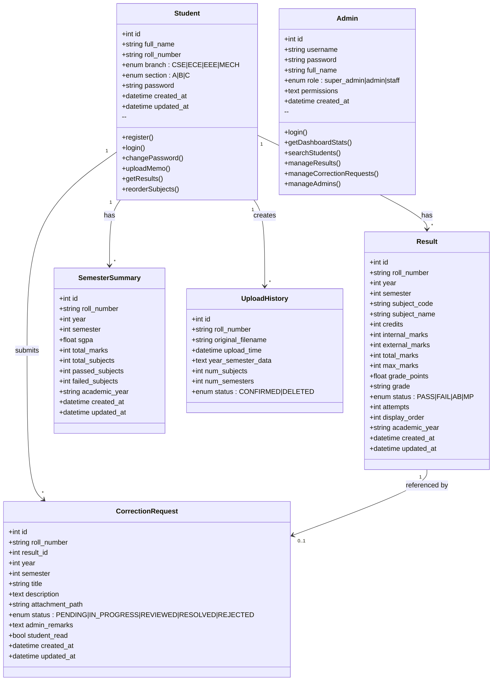

---

### 4.3 Entity-Relationship (ER) Diagram

The ER diagram shows the database schema with primary keys, foreign keys, unique constraints, and cardinalities as implemented in MariaDB 10.11.

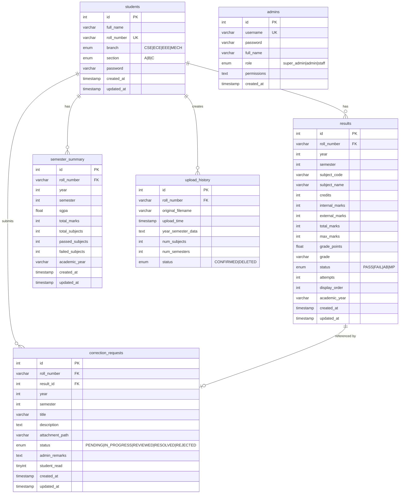

---

### 4.4 Sequence Diagram — Marks Memo Upload and OCR Processing

This sequence diagram traces the complete flow when a student uploads a marks memo, from file upload through OCR extraction, data review, and final confirmation.

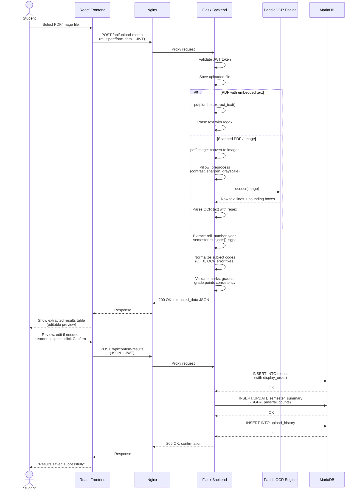

---

### 4.5 Sequence Diagram — Correction Request Workflow

This diagram shows the lifecycle of a correction request from student submission through admin review to resolution.

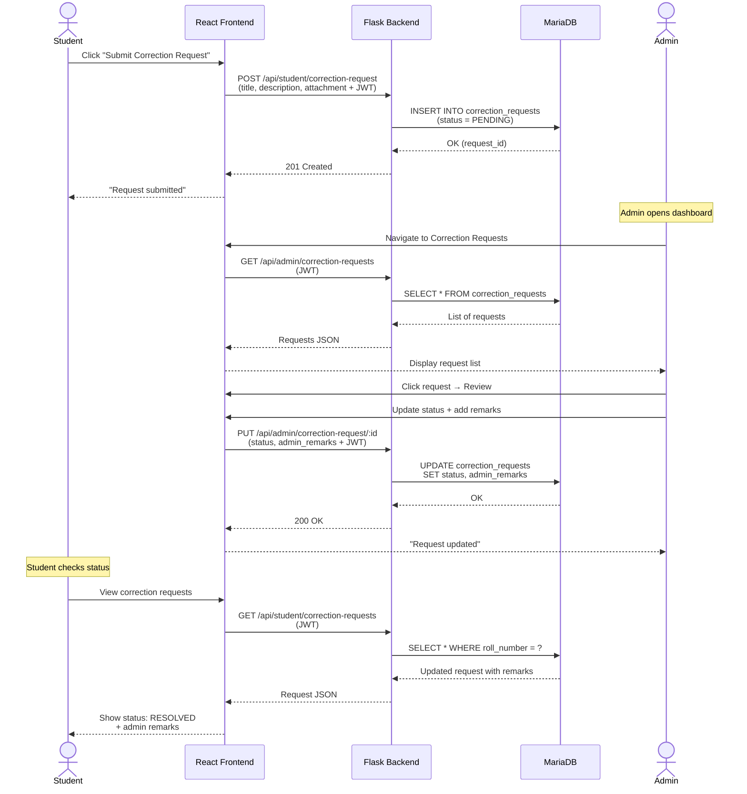

---

### 4.6 Sequence Diagram — Student Authentication

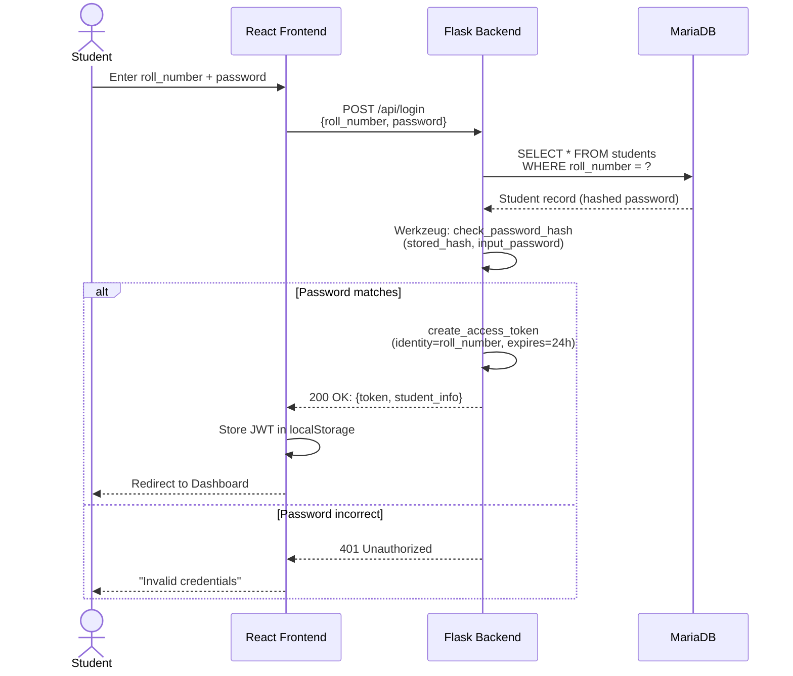

---

### 4.7 Component Diagram

The component diagram shows the software components and their dependencies within the three Docker containers.

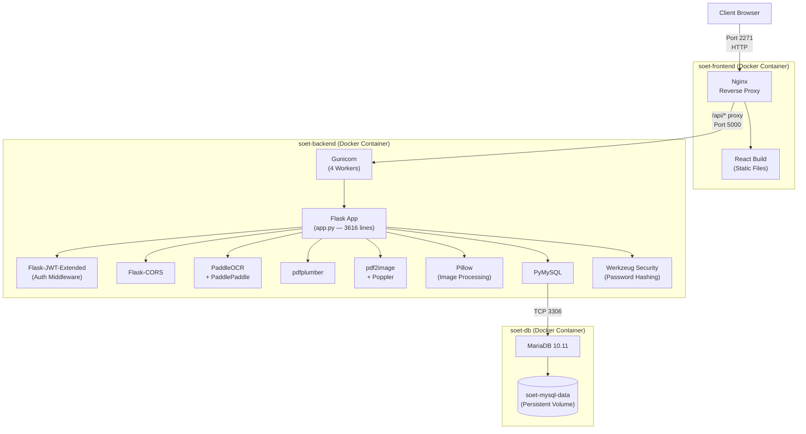

---

### 4.8 Deployment Diagram

The deployment diagram shows the physical infrastructure, network topology, and container placement.

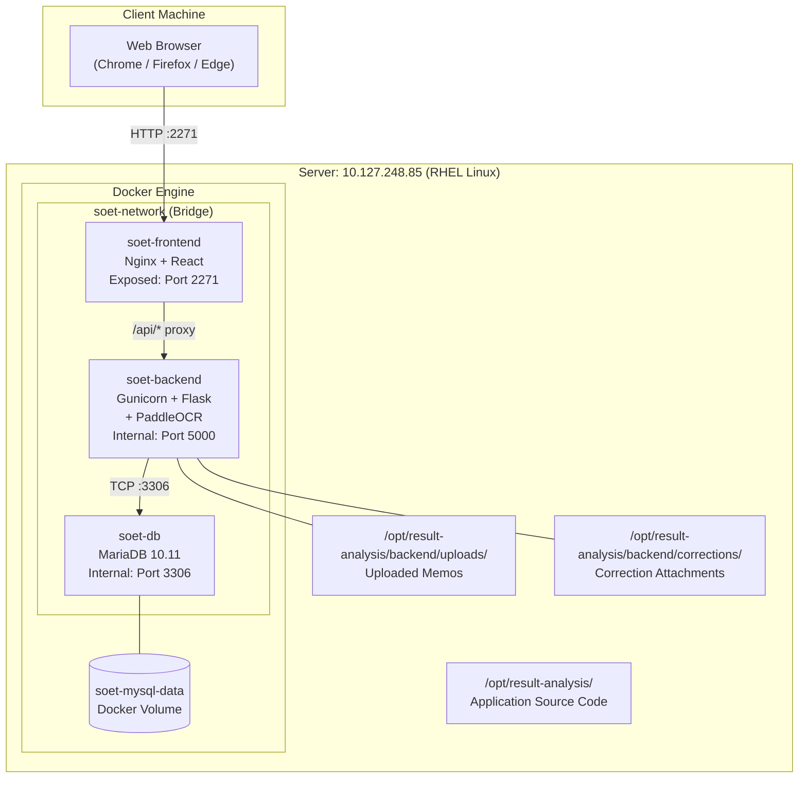

---

### 4.9 Activity Diagram — Marks Memo Upload Process

This activity diagram shows the decision flow during the OCR extraction pipeline, including the fallback from text extraction to image-based OCR.

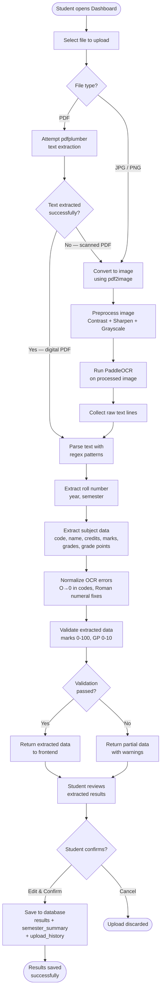

---

### 4.10 Activity Diagram — Admin Correction Request Management

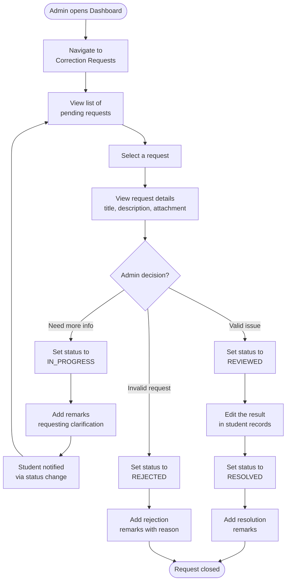

---

### 4.11 State Diagram — Correction Request Lifecycle

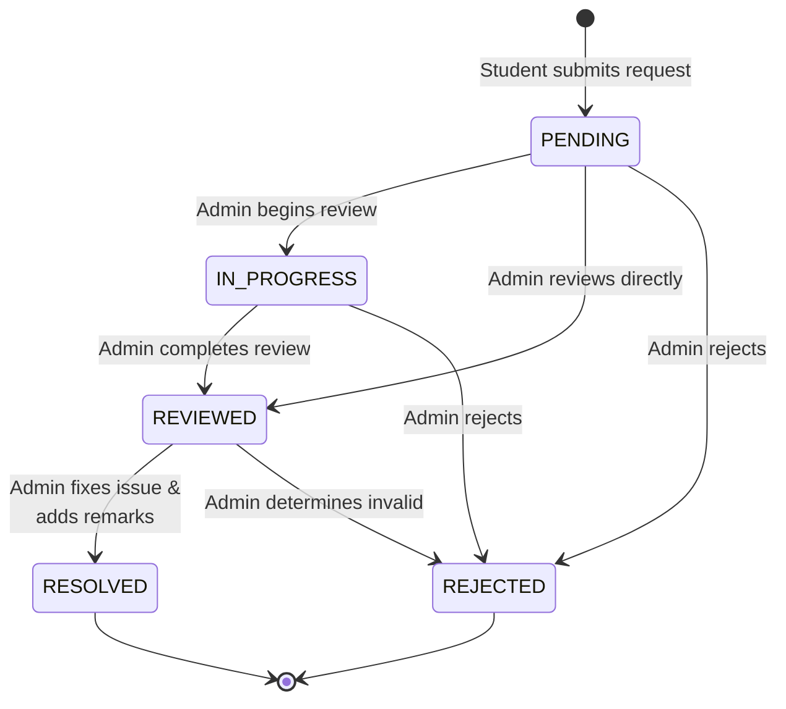

---

### 4.12 Data Flow Diagram (Level 0 — Context Diagram)

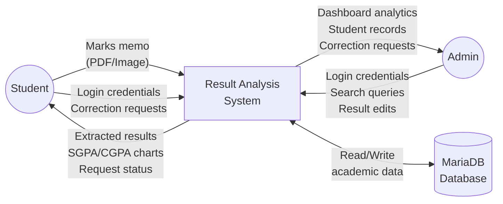

---

### 4.13 Data Flow Diagram (Level 1)

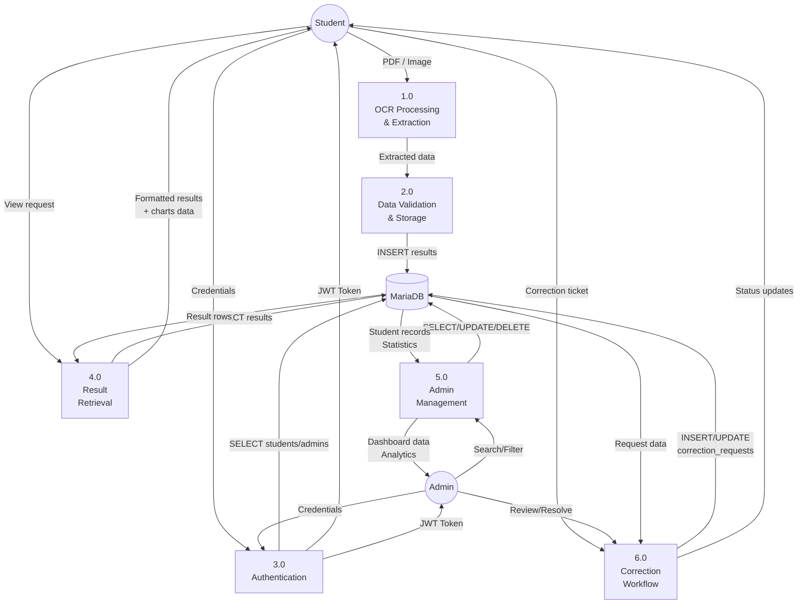

---

### 4.14 Summary of Diagrams

| # | Diagram Type | Section | Purpose |
|---|-------------|---------|---------|
| 1 | Use Case Diagram | 4.1 | Functional requirements — actor-to-function mapping |
| 2 | Class Diagram | 4.2 | Data models, attributes, methods, and relationships |
| 3 | ER Diagram | 4.3 | Database schema with keys, types, and cardinalities |
| 4 | Sequence — Upload & OCR | 4.4 | End-to-end memo processing flow |
| 5 | Sequence — Correction | 4.5 | Correction request lifecycle interaction |
| 6 | Sequence — Auth | 4.6 | Login authentication flow |
| 7 | Component Diagram | 4.7 | Software components and dependencies per container |
| 8 | Deployment Diagram | 4.8 | Physical infrastructure and container placement |
| 9 | Activity — Upload | 4.9 | OCR pipeline decision flow |
| 10 | Activity — Correction | 4.10 | Admin correction management flow |
| 11 | State Diagram | 4.11 | Correction request state transitions |
| 12 | DFD Level 0 | 4.12 | System context — external entities and data flows |
| 13 | DFD Level 1 | 4.13 | Internal process decomposition and data stores |

---

## Chapter 12: Conclusion and Future Scope

### 12.1 Summary of Work

The Result Analysis System has been successfully designed, developed, and deployed at the School of Engineering and Technology (SOET), Sri Padmavati Mahila Visvavidyalayam, Tirupati. The system represents a comprehensive solution to the longstanding challenge of manual academic result management in the university, transforming a labor-intensive, error-prone process into an automated, intelligent workflow.

The following objectives were accomplished through this project:

**1. Automated Data Extraction from Marks Memorandums**: The core innovation of the system — the integration of PaddleOCR (PP-OCRv3) for extracting structured academic data from PDF and image-based marks memos — was successfully implemented and deployed. The OCR pipeline processes a single marks memo in approximately 5-10 seconds, extracting all subject-level data (subject codes, names, credits, internal marks, external marks, total marks, grades, grade points, and pass/fail status) along with metadata (hall ticket number, student name, year, semester, and SGPA). The parser handles common OCR recognition errors including Roman numeral misreads, digit-letter confusion in subject codes, multi-line subject names, and marks expressed as words. The extraction accuracy, validated against manual verification of processed memos, demonstrates reliable performance for production use.

**2. Dual-Portal Web Application**: A fully functional web application with separate student and admin interfaces was developed and deployed. The student portal enables self-service result management — students can register, upload their own marks memos, review extracted data before confirming, view consolidated results across semesters, track SGPA/CGPA progression through interactive charts, reorder subjects to match the original document order, add missed subjects, submit correction requests with supporting attachments, and manage their account credentials. The admin portal provides comprehensive management capabilities — dashboard analytics with branch-wise and batch-wise breakdowns, student search and filtering, manual result entry and editing, correction request management with a complete lifecycle workflow (PENDING → IN_PROGRESS → REVIEWED → RESOLVED/REJECTED), admin user management with role-based access control, bulk operations, upload history tracking, and student password reset functionality.

**3. Robust Backend Architecture**: A Flask-based RESTful API server with 38+ endpoints was developed, providing a clean separation of concerns between the frontend presentation layer and backend business logic. The API handles authentication (JWT-based with 24-hour token expiry), authorization (role-based access control with super_admin, admin, and staff roles), data validation, OCR processing, grade computation (SPMVV 7-point grading scale), SGPA calculation, CGPA computation (average of semester SGPAs), and comprehensive CRUD operations for all data entities.

**4. Reliable Database Design**: A normalized relational database schema with 6 tables (students, admins, results, semester_summary, correction_requests, upload_history) was designed and implemented on MariaDB 10.11. The schema enforces data integrity through UNIQUE constraints (preventing duplicate results for the same student-semester-subject combination), foreign key relationships with CASCADE deletion (ensuring orphan-free cleanup), and appropriate data type constraints. The `display_order` column in the results table preserves the original document order of subjects, addressing a key usability requirement.

**5. Interactive Analytics and Visualization**: Rich, interactive data visualizations were implemented using the Recharts library, providing students with SGPA trend line charts and subject performance views, and providing administrators with branch-wise enrollment breakdowns, batch-wise upload tracking, and per-semester performance statistics.

**6. Correction Request Workflow**: A complete ticket-based correction request system was implemented, enabling students to formally flag data discrepancies with supporting evidence (document attachments). The workflow includes status tracking, admin review and remarks, and student notification of resolution — providing an auditable mechanism for data quality assurance.

**7. Containerized Production Deployment**: The application was packaged as three Docker containers (MariaDB, Flask backend with PaddleOCR, Nginx frontend serving React build) communicating over an isolated bridge network. Automated deployment scripts for both Linux (deploy.sh) and Windows (deploy.bat) handle the complete lifecycle — database backup, container teardown, image rebuild, container startup, database health check, and backup restoration. The application is deployed on a RHEL-based Linux server and accessible on port 2271 within the university network.

### 12.2 Key Achievements

| Metric | Achievement |
|--------|-------------|
| **API Endpoints** | 38+ RESTful endpoints covering all system functions |
| **OCR Processing Time** | ~5-10 seconds per marks memo |
| **Database Tables** | 6 tables with enforced referential integrity |
| **Frontend Pages** | 5 pages (Home, Login, Register, Student Dashboard, Admin Dashboard) |
| **Frontend Components** | Single-page application with responsive design |
| **Docker Containers** | 3 containers (DB, Backend, Frontend) on isolated network |
| **Deployment Scripts** | Automated for Linux (bash) and Windows (batch) |
| **Authentication** | JWT-based with role separation (student/admin) |
| **Password Security** | Industry-standard hashing (scrypt/pbkdf2) |
| **Supported Document Formats** | PDF, JPG, PNG marks memos |
| **Grading Scale** | SPMVV 7-point scale (O, A, B, C, D, P, F) + AB |
| **Admin Roles** | 3-tier RBAC (super_admin, admin, staff) |
| **Correction Workflow States** | 5 states (PENDING, IN_PROGRESS, REVIEWED, RESOLVED, REJECTED) |

### 12.3 Challenges Encountered and Solutions

During the development and deployment of the system, several technical challenges were encountered and resolved:

**1. OCR Accuracy for Tabular Data**: PaddleOCR occasionally merges adjacent columns or splits single fields across lines. This was addressed through post-processing heuristics that use knowledge of the expected column order and value ranges (e.g., marks are 0-100, grade points are 0-10) to disambiguate merged or split fields.

**2. Subject Code OCR Errors**: The digit "0" and letter "O" are frequently confused by OCR engines in subject codes like "20BST04". The system normalizes subject codes by applying context-aware correction: the first two characters are expected to be year digits (replacing "O" with "0"), while the middle characters are expected to be department alphabets (replacing "0" with "O").

**3. Roman Numeral Parsing**: Year and semester values on marks memos are expressed as Roman numerals ("I Year II SEMESTER"), which PaddleOCR sometimes misreads as "IT", "Il", "1l", or "1T" for "II". A dedicated resolution function (`_resolve_roman_ocr`) handles 15+ known misread patterns.

**4. Multi-Line Subject Names**: Some subjects, particularly labs and skill-oriented courses, have long names that wrap across two lines in the marks memo. The parser collects text from the current subject code until the next subject code or stop keyword, ensuring complete name capture.

**5. Lab Subject Column Variations**: Lab subjects sometimes omit the credits column or present marks in a different column arrangement than theory subjects. The parser uses flexible numeric tail matching that adapts to varying column counts.

**6. Docker Image Build Time**: The backend Docker image includes PaddlePaddle (~193 MB) and PaddleOCR with pre-downloaded models, resulting in build times of 15-20 minutes on the deployment server. This was mitigated by leveraging Docker layer caching — unchanged layers (OS packages, pip dependencies) are cached, so only code changes trigger a full rebuild.

**7. Subject Display Order**: SQL queries originally used `ORDER BY subject_code`, which imposed alphabetical ordering and disrupted the original document sequence. This was resolved by adding a `display_order` column and modifying all queries to use `ORDER BY display_order, id`.

### 12.4 Conclusion

The Result Analysis System successfully demonstrates that the integration of modern deep learning-based OCR (PaddleOCR) with a full-stack web application (Flask + React) can effectively automate the digitization and management of university examination results. The system eliminates the manual data entry bottleneck, reduces transcription errors, provides centralized data storage with analytical capabilities, and empowers students with self-service access to their academic records.

The dual-portal architecture — with distinct student and admin interfaces sharing a common API layer — provides appropriate access segregation while maximizing code reuse. The containerized deployment model ensures reproducible, portable deployment with minimal infrastructure requirements: a single Linux server with Docker installed is sufficient to run the complete application.

The correction request workflow adds a formal quality assurance mechanism that was absent in the university's previous result management process, enabling data discrepancies to be identified, reported, and resolved through a trackable, accountable process.

The system is currently deployed and operational at the School of Engineering and Technology, SPMVV, serving students and administrators across four engineering branches (CSE, ECE, EEE, MECH) and eight semesters of the B.Tech program.

### 12.5 Future Scope

The following enhancements are proposed for future development:

**1. Batch Processing and Consolidated Result Sheets**: Extending the OCR pipeline to process multi-student consolidated result sheets (published by the university examination controller), enabling administrators to digitize entire batch results from a single document rather than processing individual student memos.

**2. Subject Difficulty Analysis Using Machine Learning**: Integrating a Random Forest classifier (prototyped but not yet deployed) to analyze subject-wise failure patterns across batches and semesters. The model would identify subjects with abnormally high failure rates, predict at-risk students based on historical performance data, and provide recommendations for academic intervention. Features would include historical pass/fail ratios, average marks, grade distributions, faculty feedback, and semester-wise trends.

**3. Advanced Analytics Dashboard**: Expanding the admin dashboard with:
   - Comparative analysis across academic years (year-over-year trends)
   - Faculty-wise performance correlation (if faculty assignment data is available)
   - Percentile ranking within branches and batches
   - Exportable PDF reports for NAAC/NBA accreditation documentation
   - Predictive analytics for student performance using regression models

**4. Automated Report Generation**: Generating formatted PDF reports including:
   - Individual student academic transcripts (consolidated marks statements)
   - Department-level result analysis reports
   - Subject-wise statistical summaries with graphical visualizations
   - Topper lists and rank sheets for academic ceremonies

**5. Multi-University Support**: Generalizing the OCR parser and grading system to support marks memo formats from multiple universities, enabling the system to be deployed at other institutions with minimal configuration. This would involve:
   - Configurable grading scales (10-point, 7-point, percentage-based)
   - Template-based memo layout definitions
   - University-specific subject code pattern configuration

**6. Mobile Application**: Developing a companion mobile application (React Native or Flutter) for students to:
   - Upload marks memos directly from phone cameras
   - View results and SGPA/CGPA on mobile devices
   - Receive push notifications for correction request updates

**7. HTTPS and Enhanced Security**: Configuring TLS/SSL termination (via Let's Encrypt or institutional certificates) for public-facing deployment, along with:
   - Two-factor authentication (2FA) for admin accounts
   - Rate limiting and brute-force protection on login endpoints
   - Audit logging for all data modifications
   - Data encryption at rest for sensitive student information

**8. Integration with University Systems**: Interfacing with existing university infrastructure:
   - Importing student enrollment data from university ERP/registration systems
   - Exporting results to the university's central examination portal
   - Single Sign-On (SSO) integration with institutional identity providers (LDAP/Active Directory)

**9. Natural Language Processing for Correction Requests**: Using NLP techniques to automatically categorize and prioritize correction requests based on their textual content, potentially auto-routing specific types of corrections (marks discrepancies vs. name spelling errors vs. subject code issues) to appropriate administrators.

**10. Performance Optimization**: 
   - Implementing Redis or Memcached for caching frequently accessed dashboard statistics
   - Adding database connection pooling (e.g., SQLAlchemy with connection pool)
   - Implementing WebSocket-based real-time notifications for correction request status changes
   - Horizontal scaling of backend workers using Docker Swarm or Kubernetes

### 12.6 Publications and Contributions

The system and its underlying approach contribute to the following areas of academic and practical interest:

1. **Applied OCR in Education**: Demonstrating a practical, deployable application of deep learning-based OCR for academic document digitization in the Indian university context.

2. **Open-Source Academic Tools**: The system's codebase provides a reference implementation for building OCR-integrated web applications for educational institutions with limited IT budgets.

3. **Docker-Based Deployment in Universities**: Demonstrating the feasibility of containerized application deployment in university environments, where IT infrastructure may be limited and deployment consistency is critical.

---

*The remaining chapters (Introduction, System Analysis and Design, System Architecture, Database Design, Implementation, OCR Pipeline, User Interface Design, Testing and Deployment, Results and Discussion, References, Appendices) will be developed in subsequent iterations of this document.*
